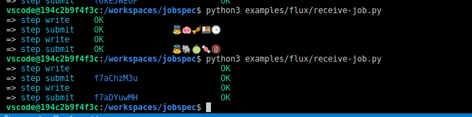

# jobspec (python)

> Translation layer for a jobspec specification to cluster execution

[](https://badge.fury.io/py/jobspec)


This library includes a cluster agnostic language to setup a job (one unit of work in a jobspec).
It is a transformational layer, or a simple language that converts steps needed to prepare a job
for a specific clusters scheduler. We are currently prototyping off of the Flux JobSpec, and intent
to derive some variant between that and something more. It is JobSpec... the next generation! 🚀️

⭐️ [Read the specification](spec.md) ⭐️


## Usage

A JobSpec consists of one or more tasks that have dependencies. This level of dependency is what can be represented in a scheduler.
The JobSpec library here reads in the JobSpec and can map that into specific cluster submit commands.
Here is an example that assumes receiving a Jobspec on a flux cluster.

#### 1. Start Flux

Start up the development environment to find yourself in a container with flux. Start a test instance:

```bash
flux start --test-size=4
```

Note that we have 4 faux nodes and 40 faux cores.

```bash
flux resource list
```
```console
     STATE NNODES   NCORES    NGPUS NODELIST
      free      4       40        0 194c2b9f4f3c,194c2b9f4f3c,194c2b9f4f3c,194c2b9f4f3c
 allocated      0        0        0
      down      0        0        0
```

Ensure you have jobspec installed! Yes, we are vscode, installing to the container, so we use sudo. YOLO.

```bash
sudo pip install -e .
```

#### 2. Command Line Examples

We are going to run the [examples/hello-world-jobspec.yaml](examples/hello-world-jobspec.yaml). This setup is way overly
complex for this because we don't actually need to do any staging or special work, but it's an example, so intended to be so.
Also note that the design of this file is subject to change. For example, we don't have to include the transform directly in the
jobspec - it can be a file that the jobspec writes, and then the command is issued. I like it better as a piece of it, so am putting
it there for the time being, mostly because it looks nicer. I'm sure someone will disagree with me about that.

```bash
# Submit a basic set of jobs with dependencies
jobspec run ./examples/hello-world-jobspec.yaml

# Example with batch using flux
jobspec run ./examples/hello-world-batch.yaml
```

Note that the default transformer is flux, so the above are equivalent to:

```bash
jobspec run -t flux ./examples/hello-world-wait-jobspec.yaml
jobspec run --transformer flux ./examples/hello-world-wait-jobspec.yaml
```

#### 3. Python Examples

It could also be the case that you want something running inside a lead broker instance to receive Jobspecs incrementally and then
run them. This Python example can help with that by showing how to accomplish the same, but from within Python.

```bash
python3 ./examples/flux/receive-job.py
```
```console
$ python3 examples/flux/receive-job.py
=> step write                               OK
=> step submit    f7aChzM3u                 OK
=> step write                               OK
=> step submit    f7aDYuwMH                 OK
```

Just for fun (posterity) I briefly tried having emoji here:




### Frequently Asked Questions

#### Is this a Flux jobspec?

Despite the shared name, this is not a Flux jobspec. Type `man bash` to see that the term "jobspec" predates flux. If we lived in a universe of just Flux, sure we wouldn't need this. But the world is more than Flux, and we want to extend our Jobspec to that - providing an abstraction that works with Flux, but also works with other workload managers and compute environments and application programming interfaces.

#### What are steps?

A step is a custom setup or staging command that might be allowed for a specific environment. For example, workload managers that know how to map or stage files can use the "stage" step. General steps to write scripts can arguably used anywhere with some form of filesystem, shared or not. The steps that are allowed for a task are shown in the [spec](spec.md). At the onset we will make an effort to only add steps that can be supported across transformer types.

#### Where are the different transformers defined?

We currently have our primary (core) transformers here in [jobspec/transformer](jobspec/transformer), however a registry that discovers jobspec-* named Python modules can allow an out of tree install and use of a transfomrmer. This use case is anticipating clusters with some custom or private logic that cannot be shared in a public GitHub repository.


### Means of Interaction

There are several likely means of interacting with this library:

- As a service that runs at some frequency to receive jobs (written as a loop in Python in some context)
- As a cron job that does the same (an entry to crontab to run "jobspec" at some frequency)
- As a one off run (an example above)

For the example usage here, and since the project I am working on is concerned with Flux, we will start with the simplest case - a client that is running inside a flux instance (meaning it can import flux) that reads in a jobspec with a section that defines a set of transforms, and then issues the commands to stage the setup and use flux to run the work defined by the jobspec.

## Developer

### Organization

While you can write an external transformer (as a plugin) a set of core transformers are provided here:

 - [jobspec/transformer](jobspec/transformer): core transformer classes that ship internally here.

### Writing a Transformer

For now, the easiest thing to do is add a single file (named by your transformer) to [jobspec/transformer](jobspec/transformer)
and copy the precedence in the file. A transformer minimally is a class with a name, description, and some number of steps.
You can then use provided steps in [jobspec/steps](jobstep/steps) or use the `StepBase` to write your own. At the end of
your transformer file you simply need to register the steps you want to use:

```python
# A transformer can register shared steps, or custom steps
Transformer.register_step(steps.WriterStep)
Transformer.register_step(batch)
Transformer.register_step(submit)
Transformer.register_step(stage)
```

If there is a skip you want the user to be able to define (but skip it for your transformer, for whatever reason you might have)
just register the empty step with the name you want to skip. As an example, let's say my transforer has no concept of a stage
(sharing a file across separate nodes) given that it has a shared filesystem. I might want to do:

```python
import jobspec.steps as steps

# This will not fail validation that the step is unknown, but skip it
Transformer.register_step(steps.EmptyStep, name="stage")
```

## License

HPCIC DevTools is distributed under the terms of the MIT license.
All new contributions must be made under this license.

See [LICENSE](https://github.com/converged-computing/cloud-select/blob/main/LICENSE),
[COPYRIGHT](https://github.com/converged-computing/cloud-select/blob/main/COPYRIGHT), and
[NOTICE](https://github.com/converged-computing/cloud-select/blob/main/NOTICE) for details.

SPDX-License-Identifier: (MIT)

LLNL-CODE- 842614
